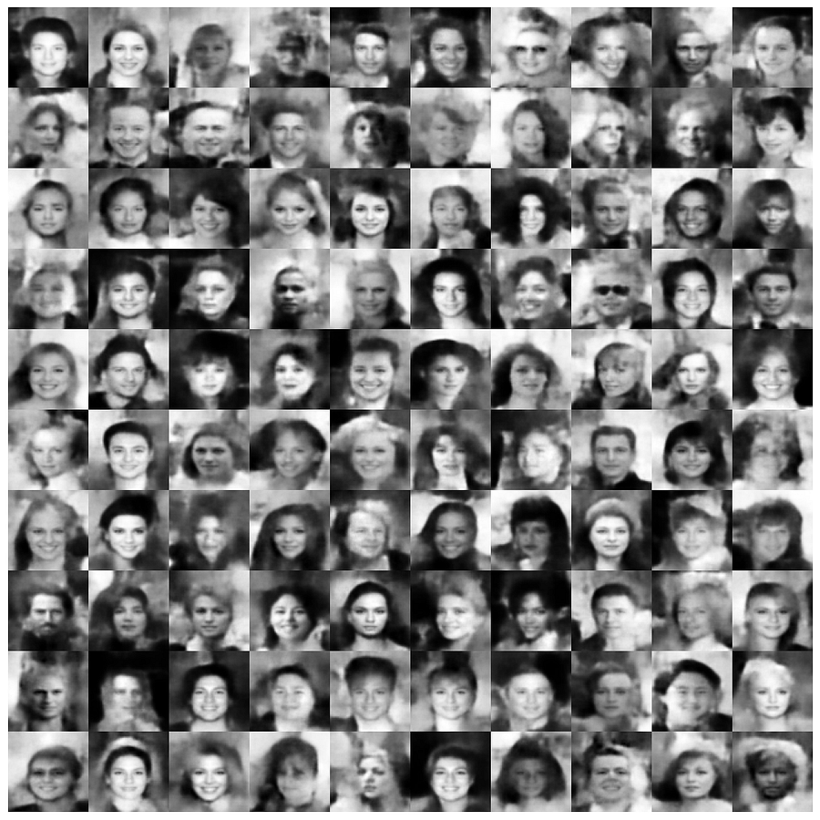
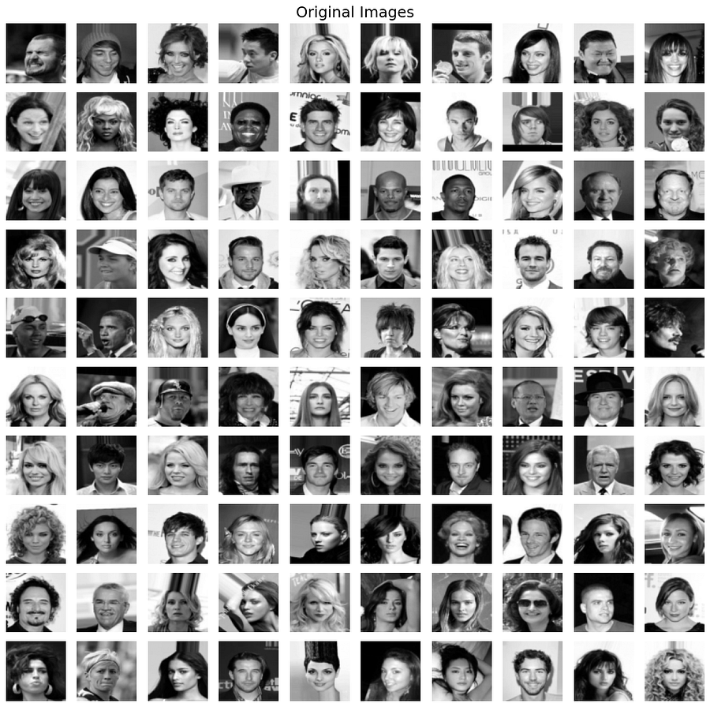
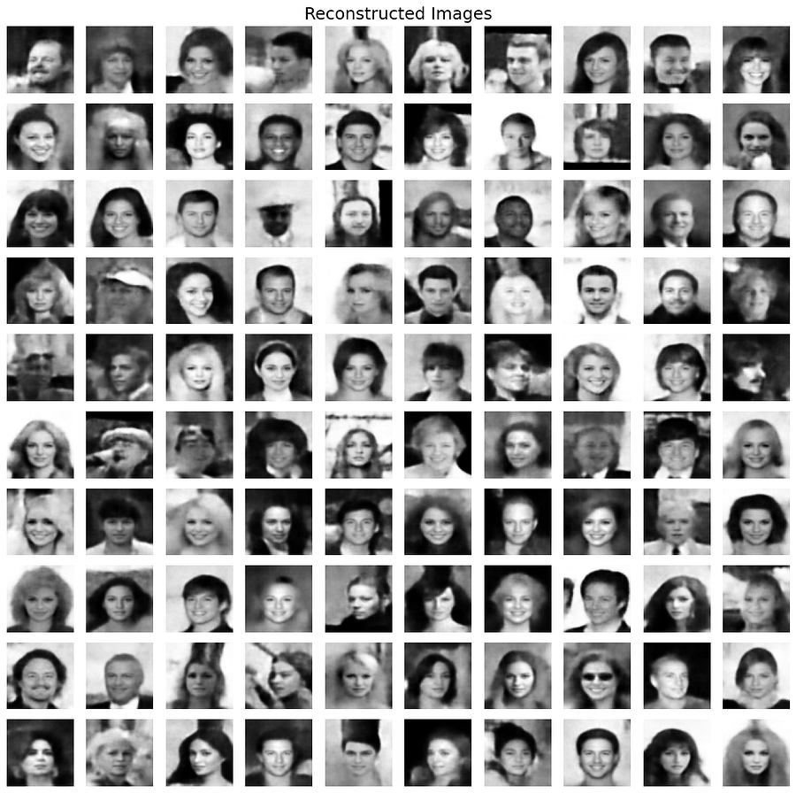

# CNN-VAE-PyTorch-Implementation

This repository implements a Convolutional Variational Autoencoder (CNN-VAE) architecture from scratch in PyTorch, mapping complex high-dimensional image topologies onto a low-dimensional Gaussian latent space manifold.

## Technical Blog

I documented the complete implementation journey, the mathematics behind variational inference, architecture decisions, and training insights here: **[Building CNN-VAE From Scratch: A Variational Journey](your-blog-link)**

The repository contains a fully modular encoder-decoder pipeline optimized for stable latent space distribution modeling without the mode-collapse challenges commonly associated with adversarial training.

### Project Evolution

This work originated from a fully connected **MLP-VAE** implementation trained on the MNIST dataset, built to understand:

* Variational inference
* ELBO optimization
* The reparameterization trick
* KL divergence regularization
* Latent space clustering and interpolation

**[MLP-VAE PyTorch Implementation From Scratch](https://github.com/Himanshu7921/scratch-variational-autoencoder)**

After establishing a strong theoretical and implementation foundation, the architecture was scaled to a deep convolutional VAE (CNN-VAE) capable of learning richer spatial hierarchies from human face datasets such as CelebA.

### Related Projects

If you're interested in adversarial generative modeling and non-cooperative game theory optimization dynamics, check out:
**[DCGAN PyTorch Implementation From Scratch](https://github.com/Himanshu7921/DCGAN-PyTorch-Implementation-From-Scratch)**

---

# Variational Autoencoders (VAE)

The objective of a Variational Autoencoder (VAE) is to maximize the marginal log-likelihood of the observed data $\log p(x)$. Since direct optimization of this marginal distribution is intractable, we introduce a recognition model $q_\phi(z|x)$ to approximate the true intractable posterior $p_\theta(z|x)$.

---

## End-to-End Derivation of the Evidence Lower Bound (ELBO)

We begin by expressing the marginal log-likelihood for a single data point $x$:

$$\log p_\theta(x) = \int q_\phi(z|x) \log p_\theta(x) \, dz$$

Using Bayes' rule, $p_\theta(x) = \frac{p_\theta(x, z)}{p_\theta(z|x)}$, we substitute this into the integral:

$$\log p_\theta(x) = \int q_\phi(z|x) \log \left( \frac{p_\theta(x, z)}{p_\theta(z|x)} \right) \, dz$$

Multiply the numerator and denominator by the variational distribution $q_\phi(z|x)$:

$$\log p_\theta(x) = \int q_\phi(z|x) \log \left( \frac{p_\theta(x, z)}{q_\phi(z|x)} \cdot \frac{q_\phi(z|x)}{p_\theta(z|x)} \right) \, dz$$

Using the logarithmic identity $\log(A \cdot B) = \log A + \log B$, we separate the terms into two separate integrals:

$$\log p_\theta(x) = \int q_\phi(z|x) \log \left( \frac{p_\theta(x, z)}{q_\phi(z|x)} \right) \, dz + \int q_\phi(z|x) \log \left( \frac{q_\phi(z|x)}{p_\theta(z|x)} \right) \, dz$$

The second term on the right-hand side is by definition the Kullback-Leibler (KL) divergence between $q_\phi(z|x)$ and $p_\theta(z|x)$:

$$D_{KL}(q_\phi(z|x) \,\|\, p_\theta(z|x)) = \int q_\phi(z|x) \log \left( \frac{q_\phi(z|x)}{p_\theta(z|x)} \right) \, dz$$

The first term is defined as the Evidence Lower Bound ($\text{ELBO}(\theta, \phi; x)$):

$$\mathcal{L}_{\text{ELBO}}(\theta, \phi; x) = \int q_\phi(z|x) \log \left( \frac{p_\theta(x, z)}{q_\phi(z|x)} \right) \, dz = \mathbb{E}_{q_\phi(z|x)}\left[ \log \left( \frac{p_\theta(x, z)}{q_\phi(z|x)} \right) \right]$$

Thus, the decomposition of the marginal log-likelihood is:

$$\log p_\theta(x) = \mathcal{L}_{\text{ELBO}}(\theta, \phi; x) + D_{KL}(q_\phi(z|x) \,\|\, p_\theta(z|x))$$

Since the KL divergence is non-negative ($D_{KL} \geq 0$), it provides a strict lower bound on the marginal log-likelihood:

$$\log p_\theta(x) \geq \mathcal{L}_{\text{ELBO}}(\theta, \phi; x)$$

---

## Decomposing the ELBO

We can further expand the expectation within the $\text{ELBO}$ using the joint distribution factorization $p_\theta(x, z) = p_\theta(x|z)p(z)$:

$$\mathcal{L}_{\text{ELBO}}(\theta, \phi; x) = \mathbb{E}_{q_\phi(z|x)}\left[ \log \left( \frac{p_\theta(x|z)p(z)}{q_\phi(z|x)} \right) \right]$$

$$\mathcal{L}_{\text{ELBO}}(\theta, \phi; x) = \mathbb{E}_{q_\phi(z|x)}\left[ \log p_\theta(x|z) \right] + \mathbb{E}_{q_\phi(z|x)}\left[ \log \left( \frac{p(z)}{q_\phi(z|x)} \right) \right]$$

Converting the second term back into its explicit integral and KL divergence representation:

$$\mathcal{L}_{\text{ELBO}}(\theta, \phi; x) = \mathbb{E}_{q_\phi(z|x)}\left[ \log p_\theta(x|z) \right] - D_{KL}(q_\phi(z|x) \,\|\, p(z))$$

To train the VAE via gradient descent, we minimize the negative ELBO, which yields our complete Loss Function:

$$\mathcal{L}_{\text{VAE}}(\theta, \phi; x) = -\mathbb{E}_{q_\phi(z|x)}\left[ \log p_\theta(x|z) \right] + \beta D_{KL}(q_\phi(z|x) \,\|\, p(z))$$

Where:

* **The Reconstruction Loss** $-\mathbb{E}_{q_\phi(z|x)}\left[ \log p_\theta(x|z) \right]$ forces the decoder to map latent vectors back to the input space accurately (e.g., using Mean Squared Error).
* **The Regularization Loss** $D_{KL}(q_\phi(z|x) \,\|\, p(z))$ forces the approximate posterior toward the isotropic Gaussian prior $p(z) \sim \mathcal{N}(0, I)$.
* **$\beta$ Scaling factor** controls the trade-off between reconstruction quality and latent space distribution smoothness during optimization.

---

# CNN-VAE-PyTorch-Implementation

This repository implements a Convolutional Variational Autoencoder (CNN-VAE) architecture in PyTorch.

The project focuses on implementing a standard VAE training pipeline utilizing deep 2D convolutional and transposed convolutional networks to map complex high-dimensional image topologies onto a low-dimensional Gaussian latent space manifold.

## Technical Documentation

Initially, this project evaluated simple multi-layer perceptron variations of autoencoders to track bottlenecks and reconstructions. To capture localized spatial features and structural components within image boundaries efficiently, the layout was updated to a purely convolutional scheme.

The repository contains:

* End-to-end PyTorch implementation of a Convolutional VAE
* Modular Encoder and Decoder networks
* Reparameterization trick implementation for backpropagation
* Controlled $\beta$-annealing scheduler for optimization stability
* CelebA dataset image loading pipeline
* Convolutional downsampling and transposed upsampling arrays
* Experiment-ready training configuration
* Reproducible model checkpoints and code bases

You can directly run the training script and the model will use predefined configuration settings.

---

# Repository Objective

The primary objective of this implementation is to study:

* Variational inference in deep generative models
* Latent manifold smooth mapping and continuous tracking
* Stability of variational balance using $\beta$-annealing
* Reconstruction capabilities of deep convolutional autoencoders
* Spatial feature dimensionality compression and transformation

The implementation is intentionally modular to make experimentation with:

* Target reconstruction loss metrics (MSE vs. BCE)
* Variational latent space dimension scaling
* Base convolutional feature channel capacity
* Adaptive learning schedules and structural tuning
* Prior modification and distribution modeling

more convenient for future research extensions.

---

# Dataset

Training was performed on a modified version of the CelebA dataset.

Dataset characteristics:

| Property | Value |
| --- | --- |
| Dataset | CelebA |
| Image Type | Human Faces |
| Channels | Grayscale (1) |
| Resolution | 64×64 |
| Preprocessing | Resize |
---

# Training Results

The CNN-VAE was trained for 200 epochs on the CelebA dataset. Unlike standard adversarial training (GANs), the VAE optimization objective yields a stable coordinate space devoid of mode collapse, prioritizing smooth structural distributions.

## 1. Latent Space Sampling (Generative Pipeline)

The image grid below demonstrates the generative capacity of the model. These samples were synthesized by passing random latent distributions $z \sim \mathcal{N}(0, I)$ directly through the fully trained decoder network:

<p align="center">
  
</p>

---
## 2. Input Reconstruction vs. Original Performance

To verify the fidelity of the variational bottleneck layer, target testing images from the validation partition were mapped onto the latent parameters $(\mu, \sigma)$ via the encoder and reconstructed via the decoder. 

The section below presents a comparative look at the ground truth images against the structural reconstructions synthesized by the network, highlighting how the model compresses global topology, facial boundaries, and lighting distributions.

<!-- ### Ground Truth (Original Input)
The original grayscale target faces fed into the convolutional encoder network:
<p align="center">
  
</p>

### VAE Reconstruction Output
The corresponding outputs reconstructed from the 64-dimensional latent bottleneck space:
<p align="center">
  
</p> -->

## 2. Input Reconstruction Performance

| Original Ground Truth | VAE Reconstruction |
| :---: | :---: |
|  |  |

### Qualitative Assessment:
* **Generative Sample Properties:** Showcases highly smooth identity interpolation curves, structural symmetry, and realistic background transitions.
* **Reconstruction Properties:** Modest high-frequency blurring is visible on some samples. Because VAEs maximize the Evidence Lower Bound (ELBO) as a tractable surrogate rather than directly optimizing the true data likelihood $\log p(x)$, the model prioritizes capturing the dominant global modes of the distribution.

### Target Input Reconstruction Consistency

Original dataset testing batches mapped onto the bottleneck and structural reconstructions synthesized by the model:

The generated samples demonstrate:

* Smooth transition curves within continuous identity interpolation
* Absence of standard adversarial mode collapses
* Regularized structural alignments across facial dimensions
* Stable texture modeling and background boundary constraints

---

# Architecture Overview

## Encoder Architecture

The encoder maps a single-channel input image down to localized feature vectors using consecutive convolutional transformations to yield explicit parameters for the Gaussian distribution $\mu$ and $\log \sigma^2$.

```python
CNNEncoder(
  (conv1): Conv2d(1, 64, kernel_size=(4, 4), stride=(2, 2), padding=(1, 1))
  (bn1): BatchNorm2d(64, eps=1e-05, momentum=0.1, affine=True, track_running_stats=True)
  (conv2): Conv2d(64, 128, kernel_size=(4, 4), stride=(2, 2), padding=(1, 1))
  (bn2): BatchNorm2d(128, eps=1e-05, momentum=0.1, affine=True, track_running_stats=True)
  (conv3): Conv2d(128, 256, kernel_size=(4, 4), stride=(2, 2), padding=(1, 1))
  (bn3): BatchNorm2d(256, eps=1e-05, momentum=0.1, affine=True, track_running_stats=True)
  (conv4): Conv2d(256, 512, kernel_size=(4, 4), stride=(2, 2), padding=(1, 1))
  (bn4): BatchNorm2d(512, eps=1e-05, momentum=0.1, affine=True, track_running_stats=True)
  (flatten): Flatten(start_dim=1, end_dim=-1)
  (fc_mean): Linear(in_features=8192, out_features=64, bias=True)
  (fc_logvar): Linear(in_features=8192, out_features=64, bias=True)
)
```

---

## Decoder Architecture

The decoder sample engine collects a random vector or engineered latent coordinate, scales it back into a convolutional block target array, and passes it through an inverted transposed grid path.

```python
CNNDecoder(
  (fc): Linear(in_features=64, out_features=8192, bias=True)
  (deconv1): ConvTranspose2d(512, 256, kernel_size=(4, 4), stride=(2, 2), padding=(1, 1))
  (bn1): BatchNorm2d(256, eps=1e-05, momentum=0.1, affine=True, track_running_stats=True)
  (deconv2): ConvTranspose2d(256, 128, kernel_size=(4, 4), stride=(2, 2), padding=(1, 1))
  (bn2): BatchNorm2d(128, eps=1e-05, momentum=0.1, affine=True, track_running_stats=True)
  (deconv3): ConvTranspose2d(128, 64, kernel_size=(4, 4), stride=(2, 2), padding=(1, 1))
  (bn3): BatchNorm2d(64, eps=1e-05, momentum=0.1, affine=True, track_running_stats=True)
  (deconv4): ConvTranspose2d(64, 1, kernel_size=(4, 4), stride=(2, 2), padding=(1, 1))
)

```

---

# Architectural Design Principles

The design focuses explicitly on maximizing stable posterior alignment:

| Technique | Purpose |
| --- | --- |
| Strided Convolutions | Downsample images natively without lossy max-pooling operations |
| Transposed Convolutions | Upsample continuous representations back to spatial grids |
| Reparameterization Trick | $z = \mu + \epsilon \odot \sigma$ allows backward path derivation through code layers |
| $\beta$-Annealing | Starts training focusing strictly on reconstruction before fading in the KL penalty |
| LeakyReLU in Encoder | Prevent dead activation units during target feature extraction |

---

# Training Configuration

The project is structured entirely around the following explicit execution configuration parameters:

| Hyperparameter | Value |
| --- | --- |
| Learning Rate (`lr`) | 2e-4 |
| Latent Dimension | 64 |
| Image Resolution (`size`) | 64×64 |
| Optimizer | Adam |
| Batch Size | 64 |
| Total Epochs | 200 |
| Beta Anneal Epochs | 40 |
| Base Filters | 64 |
| Input Channels | 1 (Gray) |

---

# Project Structure

```text
.
├── data/                         # Dataset directory (CelebA images)
├── output/                       # Reconstructions and samples saved here
├── saved_model/                  # PyTorch model state tracking binaries
│   └── CNN_VAE.pth               # Final optimized parameters checkpoint
│
├── src/
│   ├── blocks.py                 # Reusable neural network blocks
│   ├── config.py                 # Hyperparameter declarations dictionary
│   ├── encoder.py                # Encoder parameter scaling maps
│   ├── decoder.py                # Decoder reconstruction maps
│   ├── model.py                  # Full VAE routing with reparameterization
│   ├── sample.py                 # Latent space synthesis routine
│   ├── train.py                  # Main training loop script
│   └── utils.py                  # Tensor conversions and plotting helpers
│
├── .gitignore                    # Local storage patterns exclusion rules
└── README.md                     # Project documentation

```

---

# Running Training

Clone the repository:

```bash
git clone https://github.com/Himanshu7921/CNN-VAE-PyTorch-Implementation.git
cd CNN-VAE

```

Install dependencies:

```bash
pip install -r requirements.txt

```

Run training:

```bash
python src/train.py

```
Run sampling:

```bash
python src/sample.py

```

The model pipeline script will automatically instantiate initialization blocks, load target configurations, sequence data files, and trigger variational optimization.

---

# References

1. Diederik P. Kingma, Max Welling.
*Auto-Encoding Variational Bayes*
[https://arxiv.org/abs/1312.6114](https://arxiv.org/abs/1312.6114)
2. Carl Doersch.
*Tutorial on Variational Autoencoders*
[https://arxiv.org/abs/1606.05908](https://arxiv.org/abs/1606.05908)

---

# Author

Himanshu Singh | Deep Learning Research Engineer 2026